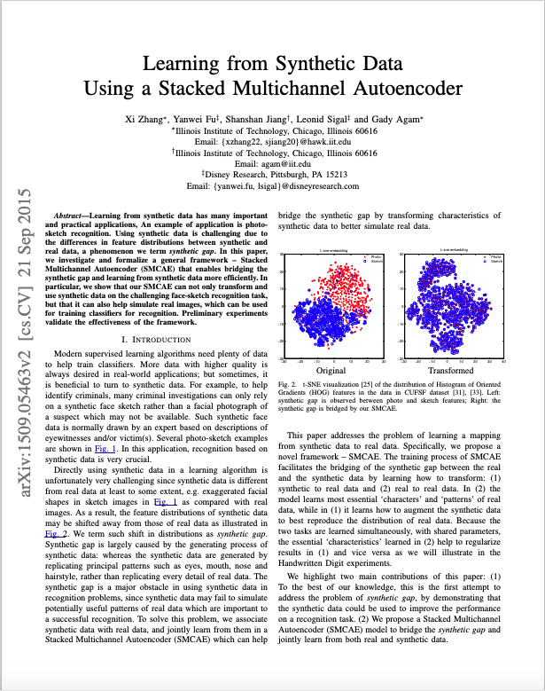

# SMCAE

## Overview
SMCAE (Stacked Multi-Channel Autoencoder) is a Python implementation of my ICMLA 2015 paper, *["Learning from Synthetic Data Using a Stacked Multichannel Autoencoder"](https://arxiv.org/abs/1509.05463).* This project focuses on a deep learning model designed to learn robust feature representations from synthetic multi-channel data, such as multi-spectral images or sensor data, using a stacked sparse autoencoder architecture. It is particularly suited for tasks like dimensionality reduction, feature extraction, and anomaly detection.

## Preview


## Features
- **Stacked Sparse Autoencoder**: Learns hierarchical, compact representations with sparsity constraints for multi-channel data.
- **Synthetic Data Support**: Optimized for learning from synthetic datasets, with robust generalization to real-world applications.
- **Multi-Channel Processing**: Handles complex inputs with multiple channels (e.g., RGB, hyperspectral data).
- **Visualization Tools**: Provides utilities to visualize learned features, reconstructions, and training progress.

## Installation
1. Clone the repository:
   ```bash
   git clone https://github.com/xzhang311/SMCAE.git
   ```
2. Navigate to the project directory:
   ```bash
   cd SMCAE
   ```
3. Install dependencies:
   ```bash
   pip install -r requirements.txt
   ```

## Usage
Train the stacked multi-channel autoencoder on a dataset:
```bash
python main.py --input path/to/synthetic_dataset --output path/to/model --sparsity 0.1
```
Use the `--help` flag for detailed configuration options, including layer sizes and training parameters:
```bash
python main.py --help
```

## Requirements
- Python 3.8+
- Libraries: TensorFlow, NumPy, Matplotlib, Scikit-learn (listed in `requirements.txt`)

## Reference
This project implements the methodology described in:
- *["Learning from Synthetic Data Using a Stacked Multichannel Autoencoder"](https://arxiv.org/abs/1509.05463),* ICMLA 2015. [arXiv:1509.05463](https://arxiv.org/abs/1509.05463)

## Contributing
Contributions are welcome! Please fork the repository, create a feature branch, and submit a pull request with your enhancements.

## License
This project is licensed under the MIT License. See the [LICENSE](LICENSE) file for details.

## Acknowledgments
This work is based on the research presented in the ICMLA 2015 paper and builds upon open-source deep learning frameworks.
